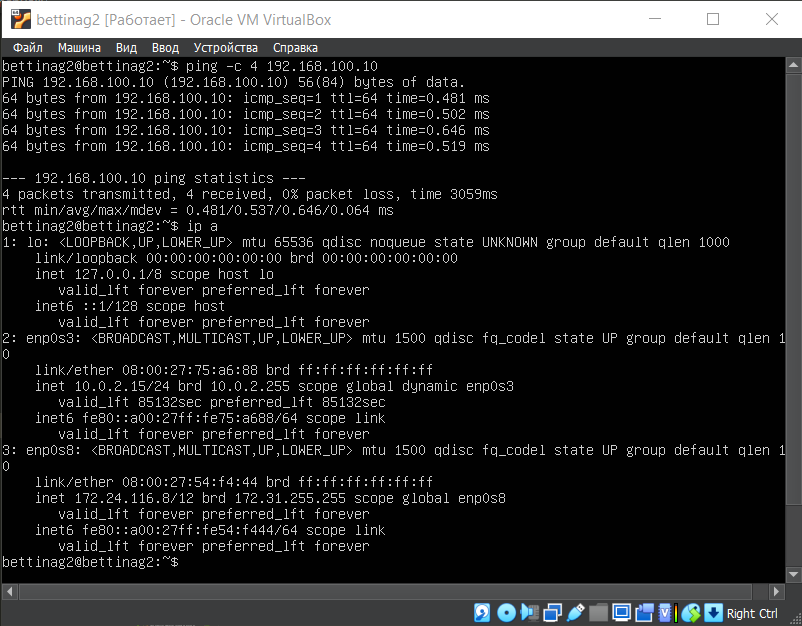
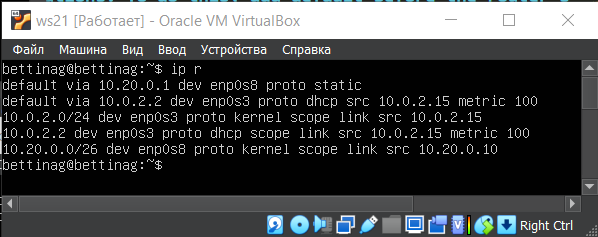
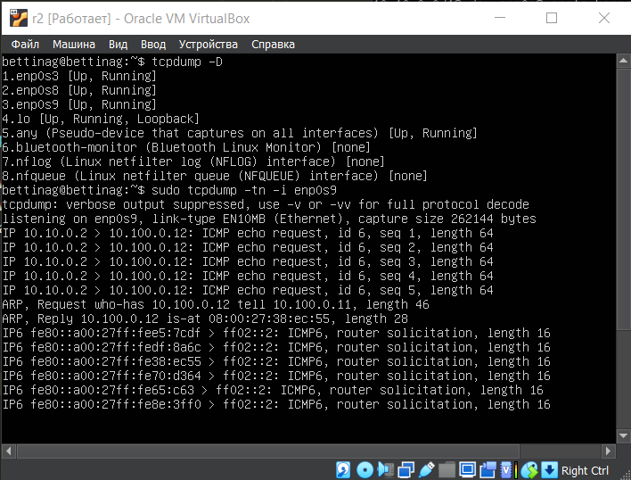
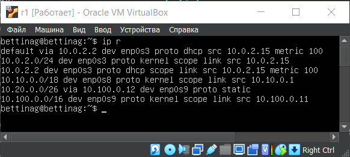
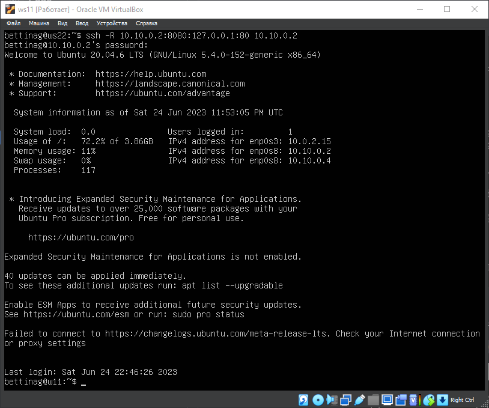

# Linux Network

**Linux networks configuration on virtual machines.**

## Theory of ipcalc utility

## Part 1. ipcalc tool

**ipcalc** is a utility that can perform simple manipulations with IPv4 addresses.
If you just type `ipcalc` without any input parameters, it will give a good "help" output with some examples that are very useful to get started.

The `ipcalc` tool can be used for the following tasks:

- check the IP address;
- show the calculated broadcast address;
- display of the host name defined via DNS;
- display of the network address or prefix.

Usage: `ipcalc [options] ADDRESS [ [/]] [NETMASK] ' .
Options:

- ` -n` (**--nocolor**) - suppress color output;
- `-b` (**--nobinary**) - suppress bitwise output;
- `-c` (**--class**) - show the network mask at;
- ` -h` (**--html**) - show results in HTML;
- ` -v` (**--version**) - show program version;
- ` -s` (**--split n1 n2 n3**) - split networks by size n1, n2, n3;
- ` -r` (**--range**) - exclude address range;
- ' --help ` - help.

Features of `ipcalc`:

- ' ipcalc` also outputs binary equivalents for each address, which helps to visualize addresses better;
- a space in the binary representation separates the network and host part of the address;
- you cannot enter the binary form of the address as input.

### Subnets

One of the most useful features of `ipcalc` is its ability to compute network segments. Here is an example of assigning addresses 10 and 20 to two different subnets:


### 1.0 Addressing

#### IP classification

There are classifications of IP addresses as "private" and "public". The following address ranges are reserved for private (also known as LAN) networks:

- _10.0.0.0_ — _10.255.255.255_ (_10.0.0.0/8_);
- _172.16.0.0_ — _172.31.255.255_ (_172.16.0.0/12_);
- _192.168.0.0_ — _192.168.255.255_ (_192.168.0.0/16_);
- _127.0.0.0_ — _127.255.255.255_ ( reserved for loop interfaces (not used for communication between network nodes), the so-called localhost).

#### Ports

The standard defines for each of the protocols **TCP** and **UDP** the possibility of simultaneous allocation of up to 65536 unique ports on the host, which are indicated by numbers from 0 to 65535.
The entire range of ports is divided into 3 groups:

- from 0 to 1023 are called privileged or reserved (used for the system and some popular programs);
- ports 1024 to 49151 are called registered ports;
- ports 49151 to 65535 are called dynamic ports.

## Part 1. ipcalc tool

### 1.1. Networks and Masks

1.  First, install the ipcalc utility

```
sudo apt update
sudo apt upgrade
sudo apt install ipcalc
```

2. Define and write in the report:

- network address of 192.167.38.54/13!

  ```
  ipcalc 192.167.38.54/13
  ```

  

  ```
  Address: 192.167.38.54
  ```

- conversion of the mask 255.255.255.0 to prefix and binary

  ```
  ipcalc 255.255.255.0
  ```

  

  ```
  Prefix: /24
  Binary: 11111111.11111111.11111111.0000000
  ```

- /15 to normal and binary

  ```
  ipcalc 0.0.0.0/15
  ```

  

  ```
  Normal: 255.254.0.0
  Binary: 11111111.11111110.00000000.0000000
  ```

- 11111111.11111111.11111111.11110000 to normal and prefix

  ```
  The ipcalc utility cannot accept addresses in binary format, so we will translate the address from binary to decimal

  11111111.11111111.11111111.11110000 -> 255.255.255.240/28

  Also we can check it via ipcalc utility

  ipcalc  255.255.255.240/28
  ```

  

  ```
  Normal: 255.255.255.240
  Prefix: /28
  ```

- minimum and maximum host in 12.167.38.4 network with masks: /8
  

  ```
  HostMin: 12.0.0.1
  HostMax: 12.255.255.254
  ```

- minimum and maximum host in 12.167.38.4 network with mask 11111111.11111111.00000000.00000000
  

  ```
  HostMin: 12.167.0.1
  HostMax: 12.167.255.254
  ```

- minimum and maximum host in 12.167.38.4 network with mask 255.255.254.0
  

  ```
  HostMin: 12.167.38.1
  HostMax: 12.167.39.254
  ```

- minimum and maximum host in 12.167.38.4 network with mask /4
  

  ```
  HostMin: 0.0.0.1
  HostMax: 15.255.255.254
  ```

### 1.2. localhost

- Define and write in the report whether an application running on localhost can be accessed with the following IPs: 194.34.23.100, 127.0.0.2, 127.1.0.1, 128.0.0.1

  ```
  We can refer to the application running on localhost with ip addresses: 127.0.0.2, 127.1.0.1
  ```

  
  

  ```
  We can not refer to the application running on localhost with ip addresses: 128.0.0.0, 194.34.23.100
  ```

  
  

  1.3. Network ranges and segments

### Define and write in a report:

- which of the listed IPs can be used as public and which only as private: 10.0.0.45, 134.43.0.2, 192.168.4.2, 172.20.250.4, 172.0.2.1, 192.172.0.1, 172.68.0.2, 172.16.255.255, 10.10.10.10, 192.169.168.1

  ```
  the following IP addresses are public: 134.43.0.2, 172.0.2.1, 192.172.0.1, 172.68.0.2, 192.169.168.1
  ```

  
  
  
  
  

  ```
  the following IP addresses are private: 10.0.0.45, 192.168.4.2, 172.20.250.4, 172.16.255.255, 10.10.10.10
  ```

  
  
  
  
  

- which of the listed gateway IP addresses are possible for 10.10.0.0/18 network: 10.0.0.1, 10.10.0.2, 10.10.10.10, 10.10.100.1, 10.10.1.255

  ```
  of the listed IP addresses of gateways on the 10.10.0.0/18 network, the following are possible: 10.10.0.2, 10.10.10.10, 10.10.1.255.
  ```

  

## Part 2. Static routing between two machines

### 2.0.1 Start two virtual machines


In the settings of each machine, in the Network tab, we set the Connection type: Internal Network.


We start both machines and set their respective hostnames:

- virtual machine 1

```
sudo hostnamectl set-hostname bettinag1
```

- virtual machine 2

```
sudo hostnamectl set-hostname bettinag2
```

### 2.0.2

Using the ip a command, we look at the existing network interfaces

```
ip a
```

- virtual machine 1

  

- virtual machine 2

  

### 2.0.3

Describe the network interface corresponding to the internal network on both machines and set the following addresses and masks: ws1 - 192.168.100.10, mask _/16 _, ws2 - 172.24.116.8, mask /12

Using the following command, we check the addresses of the machines

```
netstat -nr
```

- `-n` show numerical addresses instead of trying to determine symbolic host, port or user names.
- `-r` display the kernel routing tables

- virtual machine 1

  

- virtual machine 2

  

### 2.0.4

Now open the configuration file etc/netplan/00-installer-config.yaml.
After that, we will change the ip address field in accordance with the task

```
sudo vim /etc/netplan/00-installer-config.yaml
```

- virtual machine 1

  
  

- virtual machine 2

  
  

Run the netplan apply command to restart the network service

```
sudo netplan apply
```

- virtual machine 1

  

- virtual machine 2

  

```
ip a
```

- virtual machine 1

  

- virtual machine 2

  

## 2.1. Adding a static route manually

Add a static route from one machine to another and back using a
ip r add command.

- virtual machine 1
  ```
  sudo ip route add 172.24.116.8 dev enp0s8
  ```
  
- virtual machine 2
  ```
  sudo ip route add 192.168.100.10 dev enp0s8
  ```
  

Ping the connection between the machines

- virtual machine 1
  ```
  ping -c 4 172.24.116.8
  ```
  
- virtual machine 2
  ```
  ping -c 4 192.168.100.10
  ```
  

## 2.2. Adding a static route with saving

Restart the machines

Add static route from one machine to another using etc/netplan/00-installer-config.yaml file

- virtual machine 1

  ```
  sudo vim /etc/netplan/00-installer-config.yaml
  ```

  

  ```
  sudo netmplan apply
  ping -c 4 172.24.116.8
  ```

  

- virtual machine 2

  ```
  sudo vim /etc/netplan/00-installer-config.yaml
  ```

  

  ```
  sudo netmplan apply
  ping -c 4 192.168.100.10
  ```

  

## Part 3. iperf3 utility

### 3.1. Connection speed

Convert and write results in the report: 8 Mbps to MB/s, 100 MB/s to Kbps, 1 Gbps to Mbps

- 8 Mbps = 1 MB/s
- 100 MB/s = 800 000 Kbps
- 1 Gbps = 1000 Mbps

### 3.2. iperf3 utility

Measure connection speed between ws1 and ws2

```
In order to measure the speed between machines, one of them should be designated by the server with the command `iperf3 -s`, and the second machine should be designated by the client and send a request to the previously designated server with the command `iperf3 -c [server ip address]`
```

- virtual machine 1
  ```
  iperf3 -s
  ```
  
- virtual machine 2

  ```
  iperf3 -c 192.168.100.10
  ```

  

  Connection speed between ws1 and ws2: 1.80 Gbits/sec

## Part 4. Network firewall

### 4.1. iptables utility

Create a /etc/firewall.sh file simulating the firewall on ws1 and ws2:

The following rules should be added to the file in a row:

1. on ws1 apply a strategy where a deny rule is written at the beginning and an allow rule is written at the end (this applies to points 4 and 5)

2. on ws2 apply a strategy where an allow rule is written at the beginning and a deny rule is written at the end (this applies to points 4 and 5)

3. open access on machines for port 22 (ssh) and port 80 (http)

4. reject echo reply (machine must not ping, i.e. there must be a lock on OUTPUT)

5. allow echo reply (machine must be pinged)

- virtual machine 1

  

- virtual machine 2

  

```
The difference between the strategies applied in the first and second files is as follows: in the iptables utility, the rules are executed from top to bottom. On the first machine, the forbidding rule for exit is indicated first, so it will not be able to ping another machine. The second machine, on the contrary, has a permissive rule specified first, which means it will be able to ping another machine.
```

Run the files on both machines with chmod +x /etc/firewall.sh and /etc/firewall.sh commands.

```
sudo chmod +x /etc/firewall.sh

sudo bash /etc/firewall.sh
```

- virtual machine 1

  

- virtual machine 2

  

### 4.2. nmap utility

Use ping command to find a machine which is not pinged, then use nmap utility to show that the machine host is up

- virtual machine 1

  

- virtual machine 2

  

```
Let's check if the hosts are running with the command `nmap -Pn [address]`, where the flag `-Pn` denotes disabling ping check, since we have it disabled on one of the machines.
```

- virtual machine 1

  

## Part 5. Static network routing


### 5.1. Configuring machine addresses

- \**Customize the machine configurations in *etc/netplan/00-installer-config.yaml\* according to the network in the figure.


When configuring this network I didn't have to write static routes, because routers and machines were in the same networks, I just had to specify the address and the mask of the machine for the interface **enp0s8/9** in the configuration file.

Configuration file ws11


Configuration file ws21


Configuration file ws22


Configuration file r1


Configuration file r2


Restart the network service. If there are no errors, check that the machine address is correct with the ip -4 acommand. Also ping ws22 from ws21. Similarly ping r1 from ws11.

```
ip a
```

Addresses on ws11


Addresses on ws21


Addresses on ws22


Addresses on r1


Addresses on r2


Ping ws22 with ws21 with the command

```
ping -c 4 10.20.0.10
```


Ping r1 with ws11 with the command

```
ping -c 4 10.10.0.2
```


### 5.2. Enabling IP Forwarding.

**To enable IP forwarding, run the command on the routers:**

```
sysctl -w net.ipv4.ip_forward=1
```

With this approach, forwarding will not work after a system reboot.

- virtual machine r1

  

- virtual machine r2

  

**Open /etc/sysctl.conf file and add the following line:**

```
net.ipv4.ip_forward = 1
```

With this approach, IP forwarding is enabled permanently.

- virtual machine r1 and r2

  

### 5.3. Default route configuration

**Configure the default route (gateway) for the workstations. To do this, add default before the router's IP in the configuration file**

- virtual machine ws11

  

- virtual machine ws21

  

- virtual machine ws22

  

**Call ip r and show that a route is added to the routing table**

```
ip r
```

- virtual machine ws11

  

- virtual machine ws21

  

- virtual machine ws22

  

**Ping r2 router from ws11 and show on r2 that the ping is reaching. To do this, use the tcpdump -tn -i eth1**

Ping with ws11 router r2, the ping will not go through, because the router "does not know" where to return the answer, while the transmission of packets from the machine is carried out.

- virtual machine ws11

  ```
  ping -c 5 10.100.0.12
  ```

  

- virtual machine r2

  ```
  tcpdump -tn -i enp0s9
  ```

  

### 5.4. Adding static routes

**Add static routes to r1 and r2 in configuration file.**

- virtual machine r1

  ```
  sudo vim /etc/netplan/00-installer-config.yaml
  ```

  

- virtual machine r2

  ```
  sudo vim /etc/netplan/00-installer-config.yaml
  ```

  

**Call ip r and show route tables on both routers.**

- virtual machine r1

  ```
  ip r
  ```

  

- virtual machine r2

  ```
  ip r
  ```

  

**Run ip r list 10.10.0.0/[netmask] and ip r list 0.0.0.0/0 commands on ws11.**

- virtual machine r1

  ```
  ip r list 10.10.0.0/18
  ip r list 0.0.0.0/0
  ```

  

**Explain in the report why a different route other than 0.0.0.0/0 had been selected for 10.10.0.0/[netmask] although it could be the default route.**

    The address 0.0.0.0/0 usually means "any address", hence the command ip r list 0.0.0.0/0 will output all routes available on this device. The output of the ip r list 10.10.0.0/18 command will be different because this address is already in the network of the device and it is not necessary to refer to the router for further transmission of the packet.

### 5.5. Making a router list

**Run the tcpdump -tnv -i eth0 dump command on r1**

```
tcpdump -tn -i enp0s8
```


**Use traceroute utility to list routers in the path from ws11 to ws21**

```
traceroute 10.20.0.10
```


### 5.6. Using ICMP protocol in routing

**Run on r1 network traffic capture going through eth0 with the
tcpdump -n -i eth0 icmp command.**

```
tcpdump -tn -i enp0s8
```


**Ping a non-existent IP (e.g. 10.30.0.111) from ws11 with the
ping -c 1 10.30.0.111 command.**

```
ping -c 1 10.30.1.111
```


## Part 6. Dynamic IP configuration using DHCP

**For r2, configure the DHCP service in the /etc/dhcp/dhcpd.conf file:**

- specify the default router address, DNS-server and internal network address. Here is an example of a file for r2:

  virtual machine r2

  ```
  sudo vim /etc/dhcp/dhcpd.conf
  ```

  

- write nameserver 8.8.8.8. in a resolv.conf file

  virtual machine r2

  ```
  sudo vim /etc/resolv.conf
  ```

  

- Restart the DHCP service with systemctl restart isc-dhcp-server.

  virtual machine r2

  ```
  systemctl restart isc-dhcp-server
  ```

  

- Let's change the settings of machines ws21 and ws22 in the configuration file to make the DHCP protocol active. On each machine we enter

  ```
  sudo nano /etc/netplan/00-installer-config.yaml
  sudo netplan apply
  ```

  virtual machine w21 ans ws22

  ```
  systemctl restart isc-dhcp-server
  ```

  
  

- Reboot the ws21 machine with reboot

  ```
  sudo systemctl reboot
  ```

- show with ip a that it has got an address

  

- Also ping ws22 from ws21.

  
  

**Specify MAC address at ws11 by adding to etc/netplan/00-installer-config.yaml:**

```
sudo vim /etc/netplan/00-installer-config.yaml
sudo netplan apply
```


Go to VirtualBox Virtual Machine Manager and configure the ws11 MAC address there


**Сonfigure r1 the same way as r2, but make the assignment of addresses strictly linked to the MAC-address (ws11). Run the same tests**


**Request ip address update from ws21**

```
ip a
```


```
sudo dhclient -v
```


The following DHCP protocol options were used in Part 6:

- option routers ip-address [, ip-address...]; - gateway addresses for the client network. The routers should be listed in order of preference.
- option domain-name-servers ip-address [, ip-address...]; - List of DNS servers available to the client. Servers must be listed in order of preference.

## Part 7. NAT

**In /etc/apache2/ports.conf file change the line Listen 80 to Listen 0.0.0.0:80 on ws22 and r1, i.e. make the Apache2 server public**

virtual machine ws22

```
sudo vim /etc/apache2/ports.conf
```


virtual machine r2

```
sudo vim /etc/apache2/ports.conf
```


**Start the Apache web server with service apache2 start command on ws22 and r1**

virtual machine ws22

```
sudo service apache2 start
```


virtual machine r2

```
sudo service apache2 start
```


**Add the following rules to the firewall, created similarly to the firewall from Part 4, on r2:**

**1) delete rules in the filter table - iptables -F**

**2) delete rules in the "NAT" table - iptables -F -t nat**

**3) drop all routed packets - iptables --policy FORWARD DROP**

virtual machine r2

```
sudo vim /etc/firewall.sh
```


Next, run the created file with the command sudo /etc/firewall.sh and then check the connection between ws22 and r1 with the command ping 10.20.0.20 on r1

virtual machine r2

```
sudo chmod +x /etc/firewall.sh
sudo sh /etc/firewall.sh
```


virtual machine ws22

```
ping 10.10.0.1
```


According to these rules, the ping fails because all routed packets are discarded

**Add another rule to the file:**

**4) allow routing of all ICMP protocol packets**

virtual machine r2

```
iptables -A FORWARD -p icmp -j ACCEPT
```


**Check connection between ws22 and r1 with the ping command**

virtual machine r1

```
ping 10.20.0.20 -c 4
```


Add two more rules to the file:

**5) enable SNAT, which is masquerade all local ip from the local network behind r2 (as defined in Part 5 - network 10.20.0.0)**

**6) enable DNAT on port 8080 of r2 machine and add external network access to the Apache web server running on ws22**


The `iptables -t nat -A POSTROUTING -o enp0s9 -s 10.20.0.0/26 -j SNAT --to-source 10.100.0.12` command does the following:

- `-t nat`: Indicates `iptables` to use the NAT table.
- `-A POSTROUTING`: Adds a rule to the **POSTROUTING** chain of the **NAT** table. The **POSTROUTING** chain applies rules to packets after they have been routed.
- `-o enp0s9`: Specifies the output interface through which packets will be sent to the external network. In this case, the interface used is **enp0s9**.
- `-s 10.20.0.0/26`: Specifies the source IP address of packets to match this rule. In this case, the IP address range specified is **10.20.0.0/26**, that is, all IP addresses on the **10.20.0.0/26** network.
- `-j SNAT`: Specifies the action to be taken if a packet matches a rule. In this case, **SNAT** (Source Network Address Translation) is used, which means that the sender IP address of the packet will be replaced with the one specified in the following parameter.
- `--to-source 10.100.0.12`: Specifies the IP address to which the original IP address of the packet will be replaced. In this case, the IP address specified is **10.100.0.12**. This means that all packets matching this rule will have **10.100.0.12** as the source IP address when transmitted to the external network.

The command `iiptables -t nat -A PREROUTING -i enp0s9 -p tcp --dport 8080 -j DNAT --to-destination 10.20.0.20` does the following:

- `-A PREROUTING` adds a rule to the PREROUTING chain that processes packets before they are routed.
- `-i enp0s9` defines the enp0s9 interface as an outgoing interface, i.e., packets coming through this interface will match this rule.
- `-p tcp` specifies that the rule will only apply to TCP packets.
- `--dport 8080` indicates that the rule will only apply to packets with a destination port address of 8080.
- `-j DNAT` means that packets matching this rule will be redirected (Destination NAT) to another address.
- `--to-destination 10.20.0.20:80` specifies the address and port to which packets will be redirected.

**Check the TCP connection for SNAT by connecting from ws22 to the Apache server on r1 with the telnet [address] [port] command**


**Check the TCP connection for DNAT by connecting from r1 to the Apache server on ws22 with the telnet command (address r2 and port 8080)**


## Part 8. Bonus. Introduction to SSH Tunnels

**Run the firewall on r2 with the rules from Part 7**


**Run the Apache web server on ws22 on localhost only - in the file _/etc/apache2/ports.conf_ change the line** `Listen 80` ** to** `Listen localhost:80`


Started the server and checked that it started with `ps -A | grep apache`.

**1) Use Local TCP forwarding from ws21 to ws22 to access the web server on ws22 from ws21**

Local port forwarding allows you to forward a port on the local computer (ssh client) to a port on the remote computer (ssh server), which is then forwarded to a port on the destination computer. In this type of redirection, the SSH client listens on a specified port and tunnels any connection to that port to a specified port on the remote SSH server, which then connects to the port on the destination computer. The destination computer can be a remote SSH server or any other computer.

We will forward the port from the server using the following algorithm:

1. On machine ws22: Create a connection from machine ws22, where the ssh server is installed, to machine ws 21.
2. On machine ws22: use the command ssh -L to throw a "direct" connection from machine ws21 to machine ws22.

```
ssh 10.20.0.20
```


Staying on machine ws22, establish a connection to server ws22 from machine ws21

```
ssh -L 8080:127.0.0.1 10.20.0.20
```

Checking the processes on machine ws22 after creating a connection

```
ps aux | grep sshd
```


On the ws21 machine, start the telnet utility

```
telnet 127.0.0.1 8080
```


Check the running processes on machine ws21 and "kill" the process responsible for the connection to the server

```
ps aux | grep sshd
kill -9 1058
```


When the process on machine ws21 responsible for the connection is "killed", a message appears on machine ws22


**2) Use Remote TCP forwarding from ws11 to ws22 to access the web server on ws22 from ws11.**

Remote port forwarding is the opposite of local port forwarding. This redirects a port on the remote computer (ssh server) to a port on the local computer (ssh client), which is then redirected to a port on the destination computer. In this redirection type, the SSH server listens on a specified port and tunnels any connection on that port to a specified port on the local SSH client, which then connects to the port on the destination computer. The destination machine can be local or any other machine. Remote port forwarding is mainly used to allow someone from the outside to access an internal service.

Due to the firewall settings on router r2, it is not possible to connect to the Apache server on machine ws22 using ssh -L, from machine ws11 (router r2 will not allow the command). In this case you need to use ssh -R command. This has to be done on machine ws22, in a few steps:

1. On machine ws11: On machine ws11: switch from machine ws11 to router r2 with ssh (the router will not allow you to go directly to machine ws22);
2. On machine ws11: switch from router r2 to machine ws22 with ssh;
3. On machine ws11: tunnel from machine ws22 to machine ws11 using ssh -R;

Command description:

```
ssh -R [remote_address:]remote_port:local_address:local_port [user@]server
```

Run route. Run the command from the ws11 machine.

```
ssh 10.100.0.12
```

This command shows the following picture from the ws11 machine which will change the host of the current machine to r2


Then being physically on the same machine ws11 with host name r2, enter the following command

```
ssh 10.20.0.20
```

Being on the machine ws11, we get the following result r2 -> ws22


In the previous article on the router r2 was configured to fireWall, which does not allow passing packets from another network. So first you need to tunnel from ws22 to ws11. To do this, run the command on the ws11 machine

```
ssh -R 10.10.0.2:8080:127.0.0.1:80 10.10.0.2
```



To check if the connection worked, go to the second terminal (to do this, from the terminal of the ws11 machine, press option + fn + F2 or Alt + F2) and send the command (telnet 127.0.0.1 [local port]). At the time of this command you need to press any key

```
telnet 127.0.0.1 8080
```


